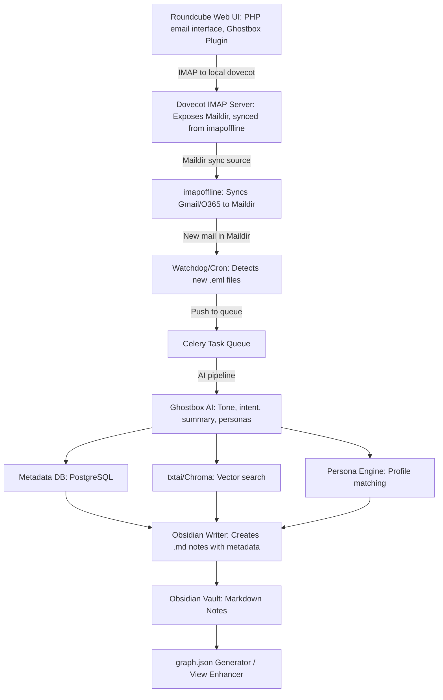

202503282232

Status: #idea

Tags: [[roundcube]] [[AI Email Assistant]] [[AI Assistant]] [[diagram]]
# AI Email Asst Architecture diagram

```mermaid
graph TD

A[Roundcube Web UI: PHP email interface, Ghostbox Plugin] -->|IMAP to local dovecot| B

B[Dovecot IMAP Server: Exposes Maildir, synced from imapoffline] -->|Maildir sync source| C

C[imapoffline: Syncs Gmail/O365 to Maildir] -->|New mail in Maildir| D

D[Watchdog/Cron: Detects new .eml files] -->|Push to queue| E

E[Celery Task Queue] -->|AI pipeline| F

F[Ghostbox AI: Tone, intent, summary, personas] --> G[Metadata DB: PostgreSQL]

F --> H[txtai/Chroma: Vector search]

F --> I[Persona Engine: Profile matching]

G --> J

H --> J

I --> J[Obsidian Writer: Creates .md notes with metadata]

J --> K[Obsidian Vault: Markdown Notes]

K --> L[graph.json Generator / View Enhancer]
```

---
# References